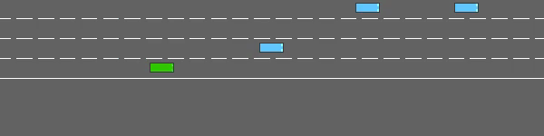
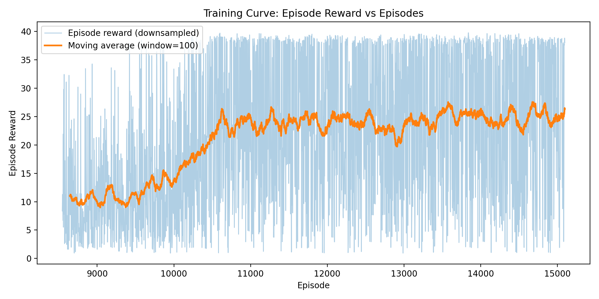

# Applied Reinforcement Learning
## Autonomous Driving with highway-env (DQN)

**Group Member**
- Salih Camcı | 2202041

> **Track:** Autonomous Driving (highway-env)  
> **Environment:** `highway-fast-v0` 

---

## Evolution Video (3 Stages)

Same env config + same seed, three checkpoints:

1) **Untrained** — random actions, crashes quickly  
2) **Half-trained** — survives longer, but still makes risky lane changes  
3) **Fully trained** — more stable high speed driving with fewer collisions

---

## Objective

Train an agent that drives **as fast as possible** in **dense traffic** while **avoiding crashes**.  
The main challenge is balancing **speed vs. safety**.

---

## Environment Setup

- Environment: `highway-fast-v0`
- Lanes: 4
- Traffic density: high (~30 vehicles)
- Episode duration: 40 steps
- CPU-friendly configuration

---

## Methodology

### Observations (State)

I use **Kinematics** observations.  
The agent sees a fixed size list of nearby vehicles with:

- presence
- relative position `(x, y)`
- relative velocity `(vx, vy)`
- heading `(cos(h), sin(h))`

This is lightweight and trains fast on CPU.

### Actions

I use **DiscreteMetaAction**:

- `LANE_LEFT`, `IDLE`, `LANE_RIGHT`, `FASTER`, `SLOWER`

This is an abstraction of a simple throttle/ steering and simplifies learning.

### Algorithm

I use **DQN (Stable-Baselines3)** because:
- the action space is discrete
- it runs efficiently on CPU
- it’s a common baseline for highway-env

**Network**
- MLP with `[256, 256]` hidden layers (ReLU)

---

## Reward Function (Custom Shaping)

The default rewards were effective, but the initial training was too "irresponsible: the agent educated to run after speed and to crash very often.
In response to this a single-syllable shaping word was fitted that compromises speed, safety and easy driving.

**Reward components:**

- $r_{\mathrm{speed}}$: normalized speed reward (mapped from the speed range)
- $r_{\mathrm{right}}$: right-lane preference reward
- $\mathbf{1}[\mathrm{collision}]$: collision penalty (discourages crashing behavior)
- $\mathbf{1}[d_{\min} < d_{\mathrm{unsafe}}]$: unsafe-distance penalty (discourages tailgating)
- $\mathbf{1}[\mathrm{lane\_change}]$: lane-change penalty (reduces left–right oscillations)

## Hyperparameters (Main Ones)

This is because hyperparameters are stored in the config file (and I do not have magic numbers in logic).

- total timesteps: **300,000**
- learning rate: **5e-4**
- buffer size: **50,000**
- batch size: **64**
- gamma: **0.99**
- target update: **1000 steps**
- exploration:
  - fraction: **0.2**
  - final epsilon: **0.05**

Why these values?
- I started close to SB3 examples, then adjusted mainly based on stability of the reward curve.
- Too aggressive exploration early on caused frequent crashes; the shaping + epsilon schedule helped.

---

## Training Analysis

**What the curve shows (brief):**
- Early phase: low reward because the policy is basically random → frequent collisions
- Middle phase: reward rises as the agent learns “don’t crash immediately”
- Late phase: curve stabilizes; improvements become smaller (policy converges under current setup)

---

## Challenges & Fixes

### 1) Too many early crashes
At first, the agent often spammed `FASTER` and changed lanes aggressively, which caused lots of collisions. I fixed this by:
- increasing collision penalty
- adding an unsafe-following penalty
- adding a small lane-change penalty

This not only enabled the behavior to become significantly smoother but also did not slow down the agent.

---

## How to Run (Quickstart)

### 1) Install
python -m venv .venv
source .venv/bin/activate  # Windows: .venv\\Scripts\\activate

pip install -r requirements.txt

2) Train
This will train for 300k timesteps and save checkpoints under models/:
- models/dqn_half.zip
- models/dqn_full.zip

python -m src.train

3) Evaluate (optional)
python -m src.evaluate --model models/dqn_full.zip

4) Plot reward curve
python -m src.plot_rewards

---

### Generate evolution video

GIF evolution is made through a recording of three agents in the same environment.
random seed and configuration, and concatenation of the videos.

#### Untrained (random policy)
python -m src.play --seed 0 --record

#### Half-trained
python -m src.play --seed 0 --record --model models/dqn_half.zip

#### Fully trained
python -m src.play --seed 0 --record --model models/dqn_full.zip

#### Merge into a single GIF
python -m src.make_evolution_gif
